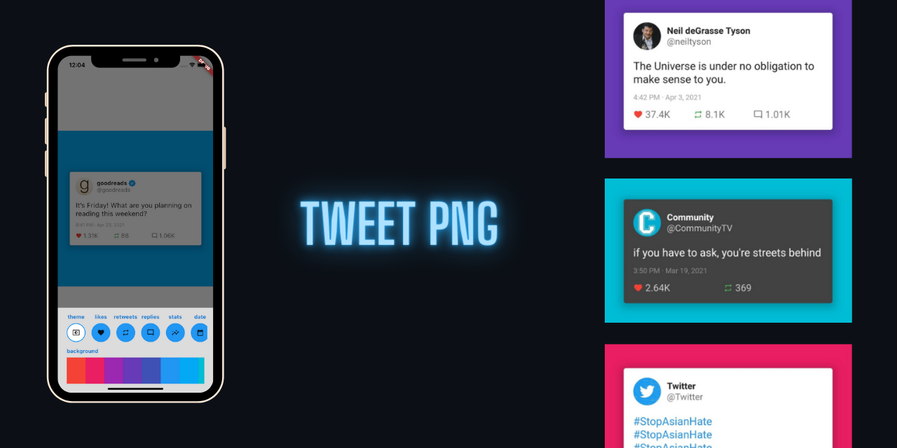

# tweet_png

A flutter app to generate beautiful, high-quality screenshots of tweets from twitter. [Follow on Instagram for more](https://www.instagram.com/tweet_png/)

## using the app

1. get your twitter **V2** API key.

- [sign-up](https://developer.twitter.com/en/apply-for-access)
- [API v2](https://developer.twitter.com/en/docs/twitter-api/early-access)

2. build the app with flutter to whatever target (does not support web due to CORS)

3. add your API key in the "new tweet" bottom-sheet (this will get persisted)

4. paste the link to a tweet in the same bottom-sheet to see the magic happen!

## Features todo

- [x] generate high quality screenshots
- [x] add / remove stats
- [x] add / remove tweet date
- [x] choose background color
- [x] dark / light theme tweet card
- [x] tweet image preview
- [x] highlight hashtags, mentions, links
- [x] verified badge
- [ ] additional layouts
- [ ] quote tweets
- [ ] tweet video preview
- [ ] pattern backgrounds
- [ ] retweet indicator
- [ ] poll tweets
